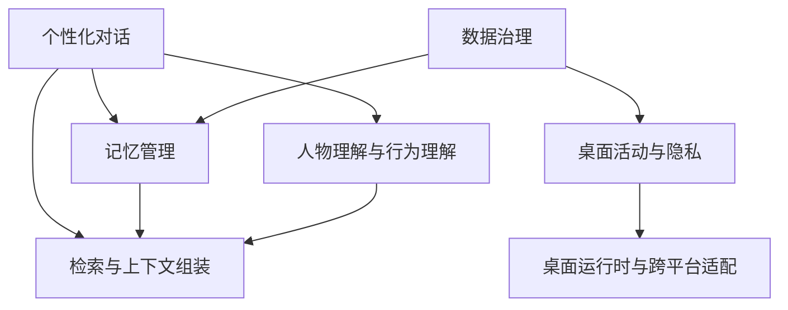
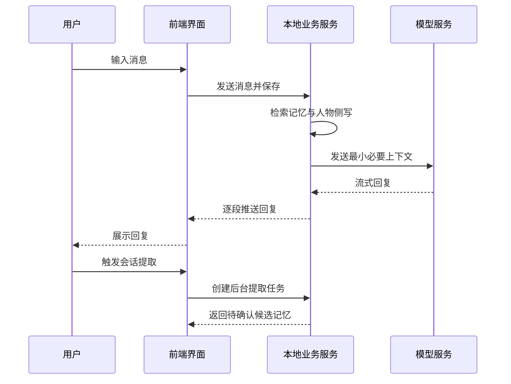
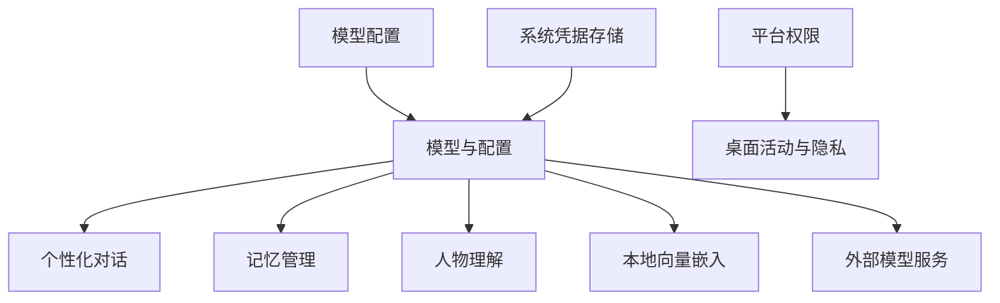
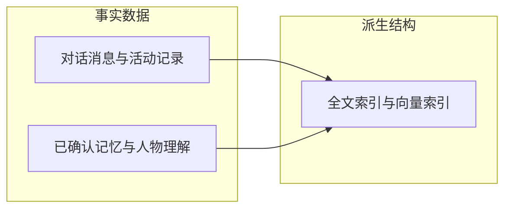

# AI Companion — 模块说明文档

> 本文档说明系统的业务功能设计、模块边界和协作关系。
> `doc/项目结构文档.md` 负责说明代码组织，本文档负责说明业务模块如何支撑产品能力。
> 更新日期：2026-07-31
>
> **项目基础信息**（版本以依赖清单文件为准）：

| 分类 | 技术 | 版本 | 用途 |
|---|---|---|---|
| 前端框架 | Vue 3 | ^3.5.40 | 页面与交互 |
| 前端语言 | TypeScript | ^7.0.2 | 前端类型安全 |
| 构建工具 | Vite | ^8.1.5 | 开发与构建 |
| 状态管理 | Pinia | ^4.0.2 | 前端跨页面状态 |
| 路由 | Vue Router | ^5.2.0 | 页面路由 |
| HTTP 请求 | Axios | ^1.18.1 | 前后端通信 |
| 样式 | Tailwind CSS | ^4.3.3 | 界面样式 |
| 图标 | FontAwesome | ^6.7.2 | 界面图标 |
| Markdown 渲染 | marked / highlight.js | ^18.0.7 / ^11.11.1 | 消息与文档渲染 |
| 桌面运行时 | Electron | ^43.1.1 | 桌面壳与本地服务管理 |
| 打包发布 | electron-builder | ^26.15.3 | 安装包构建与签名 |
| 后端语言 | Python | >=3.11 | 本地业务服务 |
| Web 框架 | FastAPI / Uvicorn | >=0.115 / >=0.32 | 本地 HTTP 服务 |
| ORM | SQLAlchemy | >=2.0.36 | 数据访问 |
| 数据校验 | Pydantic / pydantic-settings | >=2.0 | 请求校验与配置 |
| 模型调用 | httpx | >=0.27 | 外部模型请求 |
| 向量嵌入 | FastEmbed | >=0.5 | 本地嵌入推理 |
| 数值计算 | NumPy | >=1.26 | 向量余弦检索 |
| 本地数据库 | SQLite（FTS5 全文索引） | 随 Python 发行 | 事实存储与全文检索 |

---

## 1. 文档定位

本文档面向产品设计、桌面端开发、前端开发、后端开发、测试和后续维护人员，用于说明 AI Companion 的产品定位、业务边界、模块职责、模块依赖和关键业务闭环。

本文档只描述“系统需要提供什么能力”以及“能力之间如何协作”，不描述具体类、函数、接口路径或实现代码。`doc/项目结构文档.md` 负责回答“代码在哪里”，本文档负责回答“业务为什么这样切分”。

建议阅读顺序：先读第 2 章理解产品是什么，再读第 3、4 章理解端侧与模块划分，然后按需查阅第 5、6 章的单个模块，最后通过第 7、8 章理解模块间关系和完整业务闭环。后续需求拆解、任务分配和验收均以本文档为依据。

---

## 2. 系统功能定位

### 2.1 产品定义

AI Companion 是一款本地优先的个人 AI 桌面助手，面向 Windows 和 macOS。系统在用户明确授权和隐私规则约束下，保存用户的对话、桌面活动、长期记忆、用户修订和人物理解，并利用这些信息提供持续、个性化且可追溯的 AI 对话体验。

产品核心不是单次问答，而是建立以下长期闭环：

用户产生对话或活动记录 → 系统识别其中可能长期有价值的信息 → 生成候选记忆 → 用户确认、纠正、否定或删除 → 系统在后续对话中检索相关记忆 → AI 基于最小必要上下文继续服务用户 → 对话结果进一步沉淀为可确认的记忆和人物理解。

### 2.2 产品解决的问题

- 不同会话之间缺少连续性，用户需要反复解释背景、偏好和当前项目。
- AI 记住了什么、为什么记住、是否准确，用户无法控制。
- 桌面活动、对话和个人数据分散在不同位置。
- 长期使用后，用户无法有效审查、导出或删除自己的上下文数据。

### 2.3 产品边界

AI Companion 是“个人上下文与长期记忆型 AI 助手”，而不是：

- 单纯的大模型聊天套壳。
- 员工监控或考勤系统。
- 默认记录全部键盘输入的输入监控工具。
- 自动控制所有桌面软件的通用智能体。
- 完全自主执行高风险操作的自动化系统。
- 默认将全部本地数据上传到云端的数据平台。
- 以团队协作和多人权限为核心的企业系统。

### 2.4 核心产品价值

| 核心价值 | 说明 |
|---|---|
| 持续理解 | AI 能够基于用户过去确认过的信息保持长期连续性 |
| 用户可控 | 用户能够查看、确认、纠正、否定和删除系统记忆 |
| 本地优先 | 对话、活动、记忆、人物理解和后台任务优先存储在本地 |
| 可追溯 | 重要记忆和人物理解保留来源、状态和修订关系 |

### 2.5 设计原则

| 原则 | 含义 |
|---|---|
| 用户授权优先 | 活动采集、权限申请、模型调用和外部操作都以用户授权为前提，不得默认开启或隐藏开关绕过授权 |
| 隐私阻断优先 | 敏感场景在采集发生前被阻断，而不是先采集、后判断 |
| 本地事实优先 | 对话、活动、记忆、人物理解和审计数据以本地数据库为事实来源，缓存与索引不是独立事实源 |
| 模型输出只作为候选 | 模型生成的记忆、人物理解、分类和结构化结果均为候选，需经格式校验、业务规则校验和必要的用户确认 |
| 最小必要上下文 | 向外部模型只发送完成当前任务所需的最少信息 |
| 用户修订优先 | 用户确认、纠正、否定或删除的结果优先于系统自动推断 |
| 跨平台能力分级 | Windows 和 macOS 的系统权限与采集能力不同，必须区分可用、待授权、已拒绝、受限制、不支持、未实现六种状态 |

### 2.6 首版产品范围

**首版必须形成以下闭环**：Windows 和 macOS 可安装运行；Electron 稳定启动和管理本地服务；可配置至少一种外部模型；多会话流式对话；从对话生成候选记忆；用户审查、确认、纠正、否定和删除记忆；后续对话使用有效记忆；查看基础桌面活动；开启、暂停和配置隐私规则；导出、备份和删除本地数据；展示关键能力状态和错误原因。

**首版可降级能力**：

| 异常能力 | 降级结果 |
|---|---|
| 向量检索不可用 | 使用全文检索 |
| 长期记忆检索不可用 | 保留基础对话 |
| 活动采集权限缺失 | 保留对话和手动记忆 |
| 人物理解任务失败 | 保留记忆、观察和对话；对话降级为基础上下文 |
| 部分模型能力不可用 | 展示明确错误，不破坏本地数据 |

**首版暂缓能力**：全局键盘文本采集、屏幕持续截图、麦克风和摄像头采集、自动控制其他软件、自动发送外部消息、自动操作文件、跨设备云同步、团队协作、复杂插件市场、完全自主执行的桌面 Agent、默认运行本地大模型、高复杂度自动日程和邮件代理。

---

## 3. 端侧职责划分

| 端侧 | 职责定位 | 设计关注点 |
|---|---|---|
| Electron 桌面运行时 | 管理应用生命周期、窗口、托盘、权限、系统能力、本地服务和安全通信 | 服务健康恢复、平台能力分级、凭据保护 |
| Vue 前端界面 | 提供对话、记忆、活动、设置和数据管理等用户入口 | 统一交互规范、完整状态表达、错误可恢复 |
| Python 本地服务 | 承担业务流程、模型调用、记忆处理、检索、任务调度和数据治理 | 业务校验、最小必要上下文、任务最终状态 |
| SQLite 本地数据层 | 保存业务事实、全文索引、向量索引（BLOB + NumPy）、任务状态和审计信息 | 事务与级联一致、索引可重建 |
| 外部模型服务 | 只接收经过业务层筛选后的最小必要上下文 | 密钥保护、错误统一转换 |

**依赖方向**：用户界面 → 前端状态与请求层 → Electron 安全通信层 → 本地业务服务 → 业务模块与通用能力 → 本地数据库、索引和外部模型。上层可以调用下层能力，下层不能反向依赖具体页面。

**核心边界**：

- 前端界面不负责：直接读写数据库、保存最终业务事实、直接持有模型密钥、直接管理 Python 进程、直接调用操作系统高权限能力、在页面中实现记忆提取和检索排序规则。
- Electron 运行时不负责：记忆内容判断、人物理解推断、提示词业务编排、数据库领域事务、具体模型供应商业务逻辑。
- Python 本地服务不负责：创建和控制桌面窗口、直接管理前端页面、绕过 Electron 申请系统权限、绕过平台隐私设置采集数据、以明文保存密钥到普通配置文件。
- 数据层不负责：决定业务流程、生成人物理解、生成 AI 回复、处理页面状态、判断是否应该采集某个桌面场景。

---

## 4. 功能模块总览

业务模块 9 个，通用支撑能力 4 个，共 13 项。

| 模块 | 所属层级 | 定位 | 核心产出 | 直接依赖 |
|---|---|---|---|---|
| 桌面运行时与跨平台适配 | 桌面层 | 管理应用生命周期、本地服务与平台能力 | 应用运行状态、平台能力状态 | 数据治理（维护停服） |
| 安全通信与访问控制 | 桌面层 | 隔离前端与本地服务，控制可调用能力 | 安全请求与流式事件 | 桌面运行时、本地业务服务 |
| 前端应用框架 | 表现层 | 统一布局、导航、组件与交互规范 | 一致的桌面交互体验 | 安全通信 |
| 个性化对话 | 业务层 | 会话、上下文组装与流式回复 | 会话与消息、AI 内容收藏 | 模型配置、检索、记忆管理、人物理解、持久化 |
| 记忆管理 | 业务层 | 提取、审查、修订与追溯长期记忆 | 可控长期记忆 | 模型配置、后台任务、持久化 |
| 桌面活动与隐私 | 业务层 | 授权范围内采集活动并实施隐私规则 | 安全活动记录 | 跨平台适配、持久化 |
| 人物理解与行为理解 | 业务层 | 从已确认信息形成用户理解 | 观察、洞见、人物侧写 | 会话提取、后台任务、持久化 |
| 持久化与索引 | 数据层 | 保存事实数据并维护检索索引 | 本地数据与索引 | 无（最底层） |
| 数据治理 | 业务与数据层 | 管理删除、导出、手动备份和清除 | 可控数据生命周期 | 全部数据生产模块、持久化 |
| 模型与配置 | 通用支撑 | 供应商适配与统一模型能力 | 统一模型调用能力 | 跨平台适配（凭据）、外部模型服务 |
| 检索与上下文组装 | 通用支撑 | 从多种信号选择最相关上下文 | 最小必要上下文 | 持久化、记忆管理 |
| 后台任务与调度 | 通用支撑 | 处理不应阻塞主流程的派生工作 | 可追踪任务状态 | 持久化、模型配置 |
| 审计与可观测性 | 通用支撑 | 记录关键操作、能力状态与错误定位 | 审计记录与运行状态 | 持久化、全部模块 |

---

## 5. 各业务模块说明

### 5.1 桌面运行时与跨平台适配

**定位**：该模块是应用的运行底座，统一 Windows 和 macOS 的系统能力差异，为上层提供一致的平台能力状态。

**核心功能**：

- 用户可启动、退出应用，应用保证单实例运行并可在意外退出后恢复。
- 用户可管理主窗口、系统托盘和开机启动设置。
- 应用自动启动和停止本地 Python 服务，并持续检查服务健康状态；服务异常退出时提供恢复机制。
- 用户可查看应用版本和本地服务运行状态。
- 平台能力状态对上层统一可见：前台应用、窗口标题（受权限限制）、系统通知、权限申请结果。
- 模型密钥保存到操作系统安全存储。

**设计边界**：只管理运行状态和平台事实，不承担对话、记忆、人物理解和检索业务；不决定业务是否生成记忆或人物理解。

**依赖与协作**：被前端界面（经安全通信）和活动采集依赖；本地服务启动、停止和健康检查由其编排。

**开发关注点**：

- 平台能力必须区分可用、待授权、已拒绝、受限制、不支持、未实现六种状态，不得将“未授权”“未实现”和“无数据”混为一谈。
- 权限状态变化应主动通知上层，不能等前端轮询才发现。
- 退出路径必须保证本地服务停止、状态落盘；强制退出与正常退出分开处理。
- 单实例、托盘、开机启动行为需在 Windows 和 macOS 上分别验证。
- 服务异常恢复不能静默丢弃未完成的后台任务。

### 5.2 安全通信与访问控制

**定位**：该模块隔离前端渲染环境、本地桌面能力和 Python 本地服务，避免页面直接获得高权限能力。

**核心功能**：

- 前端通过白名单受控地使用桌面能力（窗口、托盘、权限、凭据等）。
- 页面业务请求统一转发到本地服务，本地服务端口和认证信息对页面隐藏。
- 对话等流式结果通过独立通道逐段推送到页面，页面不接触完整密钥。
- 验证请求来源、参数和允许访问的能力；高风险操作增加确认和权限检查。
- 阻止页面直接访问文件系统、进程和系统凭据。
- 浏览器调试模式与桌面正式模式保持一致的业务接口。

**设计边界**：不解释业务内容，只控制访问路径、请求范围和通信安全。

**依赖与协作**：被前端应用框架和个性化对话依赖；转发目标为本地业务服务；权限与凭据能力来自桌面运行时与跨平台适配。

**开发关注点**：

- 能力白名单只增不减，新增能力必须评审。
- 流式推送通道不得携带或间接暴露完整密钥。
- 调试模式与正式模式的接口行为必须一致，防止调试时可用、打包后不可用。
- 高风险操作（删除、导出）必须有明确确认链路。

### 5.3 前端应用框架

**定位**：该模块为所有用户页面提供统一的布局、导航、组件、状态管理、错误处理和交互规范。

**核心功能**：

- 用户通过统一的侧边栏导航访问全部页面：今日概览、AI 对话、活动记录、长期记忆、用户理解、模型设置、隐私设置、数据管理、系统状态。
- 全局统一请求层、加载状态、空状态、错误展示、确认交互、表单组件、弹窗通知和主题视觉。
- 所有页面均提供加载、空数据、业务错误、权限不足状态，危险操作有确认，数据与后台事实一致刷新。
- 路由页面统一懒加载；请求参数和请求体使用 snake_case，响应统一为 code、message、data 结构。

**设计边界**：前端状态用于交互和缓存，不得替代后端事实状态；页面不得直接读写数据库或持有系统密钥。

**依赖与协作**：依赖安全通信获得请求通道；被个性化对话等全部业务页面使用；不与数据库直接交互。

**开发关注点**：

- 页面只依赖统一请求层，禁止绕过请求层直连服务。
- 每个页面必须分别处理加载、空数据、业务错误、权限错误和系统错误，一个下游步骤失败不得覆盖已成功加载的数据。
- 使用自定义组件和 Tailwind CSS，不使用未经批准的组件库。
- 页面内不出现服务端口、认证信息和密钥等敏感值。

### 5.4 个性化对话

**定位**：该模块将会话历史、长期记忆和模型能力组织成连续的个性化对话体验。

**核心功能**：

- 用户可创建、选择、重命名和删除会话，进行流式对话，并可重新生成失败或不满意的回复。
- 系统自动保存用户消息和助手回复，记录模型调用结果和失败状态。
- 系统将已确认的人物理解注入系统提示词，并调用检索模块获取相关长期记忆，组装最小必要上下文。
- 回复保存本次实际使用的记忆引用，来源可追溯。
- 用户可收藏高质量的助手回复，并可将收藏内容一键采纳为候选记忆。
- 用户可手动触发会话级提取，系统以水位线标记提取进度，避免重复提取。

**设计边界**：不实现底层检索算法，不直接依赖具体模型供应商，记忆提取不阻塞主回复。

**依赖与协作**：依赖模型与配置（模型调用）、检索与上下文组装（记忆召回）、人物理解（侧写注入）和记忆管理（收藏采纳）；被前端应用框架页面调用。

**开发关注点**：

- 流式回复失败状态可识别，重新生成流程可恢复。
- 同会话并发生成需要互斥或明确排队，防止消息顺序错乱。
- 收藏、采纳等派生操作失败不影响对话主流程。
- 上下文组装必须遵守最小必要原则，并记录实际使用的记忆引用。

### 5.5 记忆管理

**定位**：该模块将对话或活动中的重要信息转化为可审查、可修订、可追溯的长期记忆。

**核心功能**：

- 系统可从会话分析和用户采纳的助手回复生成候选记忆。
- 系统校验候选记忆的内容、类型和重要性，保存记忆与来源证据的关联。
- 用户可确认、纠正、否定、删除记忆，可查看记忆来源和修订历史。
- 记忆变化时自动更新检索索引；已否定和已删除的记忆不参与检索。

**记忆状态**：候选 → 已确认 →（纠正）新版本；候选 → 已否定 / 已删除。

**设计边界**：模型不能绕过程序校验和用户控制直接写入不可修改的长期事实；首版不默认将全部活动记录自动转化为记忆。

**依赖与协作**：依赖模型与配置（提取调用）、后台任务（异步提取）、持久化与索引（存储与索引更新）；被个性化对话（检索召回）、人物理解（来源引用）和数据治理（删除联动）依赖。

**开发关注点**：

- 模型输出一律视为候选，写入前必须通过格式和业务校验。
- 用户纠正或否定优先于自动推断，自动任务不得覆盖用户修订。
- 删除记忆必须同步清理来源、修订历史和索引，不能只删主记录。
- 记忆保存成功但索引更新失败时应展示部分成功状态，不得回滚已确认的记忆。

### 5.6 桌面活动与隐私

**定位**：该模块在用户授权范围内记录基础桌面活动，并确保敏感场景在采集前被阻断。

**核心功能**：

- 用户可开启、暂停活动采集，查看隐私规则事实和运行时应用状态。
- 系统记录应用名称、窗口标题、活动开始时间、采集来源和隐私处理结果。
- 隐私规则支持全局暂停、应用黑白名单、窗口标题关键字阻断、特定时段暂停、内容脱敏、单次临时暂停和平台级敏感场景强制阻断。
- 用户可查询和删除活动记录。
- 缓冲和批量提交活动事件，处理重复事件和无效事件。

**首版不采集**：原始键盘输入、密码输入、屏幕截图、麦克风内容、摄像头内容、文件正文、剪贴板历史。

**设计边界**：活动记录是原始事实，不直接等同于长期记忆或人物理解；无配置时默认阻断全部采集，不允许“先采后审”。

**依赖与协作**：依赖跨平台适配（前台应用、窗口标题、权限）；被数据治理和审计依赖；活动记录落入持久化层。

**开发关注点**：

- 采集前必须检查平台权限和隐私规则，敏感场景直接阻断，不得先采集后判断。
- 平台级强制阻断不能被业务配置绕过。
- 批量提交必须处理重复与无效事件，避免污染事实数据。
- 暂停、恢复、规则变更的边界（时段、单次暂停）必须精确。

### 5.7 人物理解与行为理解

**定位**：该模块从用户对话中提取可追溯观察，通过自动反思形成洞见，再汇编为连贯的人物侧写。

**核心功能**：

- 会话提取阶段对用户消息执行内容观察和表达观察双通道分析，观察保留原文片段和来源消息，程序校验证据真实性。
- 观察积累到阈值后自动触发洞见反思，也支持手动触发；洞见通过成熟度、置信度、稳定度、支持证据和矛盾证据自动演化。
- 用户可纠正或否定洞见，用户修订优先于后续自动演化。
- 人物侧写由已建立洞见汇编生成，按版本全量保存，用户可编辑生成新的用户版本；通过洞见编号保持可追溯。
- 对话优先注入当前侧写，缺少侧写时降级注入稳定洞见。
- 删除观察后相关证据失效，失去全部有效证据的洞见自动降级。

**设计边界**：人物理解是基于证据的派生理解，不是医学诊断，不替代原始消息、长期记忆和活动记录；观察层不要求用户逐条确认，用户审查集中在洞见和侧写层。

**依赖与协作**：依赖会话提取产出（摘要与候选记忆作为观察来源）、后台任务（反思与汇编）、持久化；被个性化对话（侧写注入）依赖。

**开发关注点**：

- 观察必须逐字保留证据并校验来源消息归属，防止助手内容冒充用户事实。
- 证据链断裂（来源删除）后洞见必须自动降级，不能残留无证据洞见。
- 用户编辑侧写生成新版本，不覆盖历史版本。
- 反思与汇编是异步任务，失败不得阻塞对话，对话降级为基础上下文。

### 5.8 持久化与索引

**定位**：该模块作为系统本地事实源，为全部业务实体、证据关系和检索能力提供一致存储。

**核心功能**：

- 保存会话消息、活动记录、隐私规则、长期记忆及来源与修订历史、人物理解及来源与修订历史、模型非敏感配置、后台任务、审计记录、模型调用记录、导出备份记录。
- 提供事务管理、外键关系、唯一约束、级联删除和数据迁移。
- 维护全文索引（FTS5）与向量索引（嵌入向量以 BLOB 存入记忆行，FastEmbed + ONNX 本地推理生成，NumPy 余弦相似度检索）。
- 提供一致性检查、数据库健康状态和检索索引维护。

**事实与派生关系**：对话消息、活动记录、用户确认后的记忆、用户修订后的人物理解、用户配置属于事实或用户可控数据；全文索引、向量索引、部分统计缓存、搜索排序结果属于可重建派生结构。

**设计边界**：索引故障不能被解释为“没有相关记忆”；向量索引不得成为记忆的唯一存储位置。

**依赖与协作**：被全部业务模块和通用支撑能力依赖；不依赖任何上层模块。

**开发关注点**：

- 事务边界必须覆盖“主记录 + 关联记录 + 索引更新”的完整写入。
- 迁移必须可回滚；涉及模块下线的破坏性变更必须有明确授权和独立验证。
- 派生索引可以重建，但重建过程不能阻塞事实写入。
- 数据库健康状态必须可观测，供审计与可观测性模块聚合。

### 5.9 数据治理

**定位**：该模块管理本地数据从产生、审查到删除、导出、手动备份和清除的生命周期。

**核心功能**：

- 用户可删除单条活动记录、会话与消息、记忆与人物理解，系统同步处理关联证据、派生理解和索引。
- 用户可导出个人数据，导出结果包含导出时间、数据范围、文件位置和状态。
- 用户可创建和管理手动备份、清除全部本地数据。
- 系统记录不含敏感正文的审计信息。

**删除原则**：删除原始事实时同步处理相关记忆来源、派生人物理解、对话引用、全文索引、向量索引和其他关联数据，不能只删除当前页面对应的一张表。

**依赖与协作**：依赖持久化，并覆盖全部数据生产模块（对话、记忆、活动、人物理解）的数据。

**开发关注点**：

- 一致性删除必须通过证据链和派生关系递归定位，不能按页面维度删除。
- 清除全部数据前必须有二次确认与审计记录。

---

## 6. 通用支撑能力

### 6.1 模型与配置

**职责**：隔离不同模型供应商和协议差异，为上层业务提供统一的模型能力，包括流式对话、普通对话、结构化输出和本地向量生成（FastEmbed + ONNX Runtime 本地推理，默认模型 bge-small-zh-v1.5，512 维，完全离线运行）。

**使用原则**：上层业务只通过统一模型能力调用，不感知供应商差异；敏感密钥保存于操作系统安全存储，非敏感配置可存入本地配置；模型错误统一转换为业务可理解的原因。

**开发时应避免**：将密钥返回前端页面或以明文保存；向模型发送超出任务范围的历史对话、活动记录或完整人物理解；让具体供应商逻辑渗透到业务模块。

### 6.2 检索与上下文组装

**职责**：从本地记忆和必要的历史记录中选择与当前问题最相关的信息，为对话和其他 AI 能力提供上下文。全文关键词检索（FTS5 BM25）与向量语义检索（512 维本地嵌入）候选经 Reciprocal Rank Fusion 综合排序，结合时间新鲜度、记忆重要性和用户确认状态过滤，输出受控长度的可追溯上下文。

**使用原则**：检索结果需包含相关度、记忆状态、来源、时间与是否被最终采纳的信息；索引状态可查询。

**开发时应避免**：将索引故障解释为“没有相关记忆”；无长度控制地拼接上下文；忽略用户确认状态导致已否定记忆被召回；向量不可用时让对话整体不可用（应降级为全文检索，再降级为基础对话）。

### 6.3 后台任务与调度

**职责**：处理不应阻塞用户主流程的异步派生工作，包括会话级提取（含人物理解演化）、记忆向量更新、人物理解刷新和失败任务重试。

**使用原则**：任务具备创建、防重复、领取执行、失败重试、超时恢复、取消、结果记录和最终状态收敛；任务积压可观测。

**开发时应避免**：创建任务后无人消费或任务永远停留在中间状态；重复任务堆积；任务失败重试无上限导致永久占用；让后台任务直接修改已确认的用户事实。

### 6.4 审计与可观测性

**职责**：聚合本地服务、数据库、全文索引、向量索引、模型配置、权限和后台任务积压状态，记录关键设置变更、数据删除与导出、模型调用结果和本地服务异常，为用户提供可理解的错误提示，为维护提供必要日志。

**使用原则**：系统状态必须区分已配置且可用、已配置但当前不可用、未配置、权限不足、依赖能力异常、任务积压、平台不支持；错误按参数、权限、本地服务、模型连接、业务、数据库、系统分类处理。

**开发时应避免**：审计日志复制保存完整敏感正文；把“未配置”“不可用”“不支持”混为同一状态展示；权限错误不给用户操作入口；一个模块的错误无条件拖垮其他可独立运行的模块。

### 6.5 统一响应与错误处理

**职责**：规范前后端协议（snake_case 请求、code/message/data 响应、code 为 0 表示成功），由前端 API 层统一处理错误、鉴权状态和响应解析，并规范页面级状态表达（初始、加载中、成功、空数据、部分成功、权限不足、服务错误、业务错误、系统错误、重试中）。

**使用原则**：每个页面分别处理各类状态；一个下游步骤失败不得覆盖已成功加载的其他数据；允许部分成功场景（如规则加载成功但运行时同步失败、对话成功但提取失败、记忆保存成功但索引更新失败）分别展示真实状态。

**开发时应避免**：页面绕过统一请求层；后端直接返回与协议不符的裸数据；把部分成功当作整体失败或整体成功处理。

---

## 7. 模块间关键关系

### 7.1 业务模块依赖关系

说明：对话是业务中枢，同时消费记忆、人物理解和检索；数据治理覆盖全部数据生产模块。

### 7.2 端到端业务流向

说明：从用户输入到流式回复是同步主链路，记忆提取走后台任务，不阻塞主链路。

### 7.3 配置与外部依赖

说明：模型配置与凭据决定 AI 相关模块的可用性，平台权限决定活动采集能力，两者异常时对应模块降级而非整体不可用。

### 7.4 数据与任务边界

说明：事实数据是唯一事实来源，索引可重建；删除事实时必须同步重建或清理派生结构。

---

## 8. 典型业务闭环

### 8.1 完成一次个性化对话

1. 用户选择或创建会话并输入消息。
2. 系统保存用户消息。
3. 检索模块查询相关长期记忆，人物理解模块提供当前侧写。
4. 系统将侧写与相关记忆组装为最小必要上下文。
5. 模型生成流式回复，页面持续展示。
6. 系统保存完整回复和实际使用的记忆引用关系。
7. 用户认为对话告一段落时，可手动触发会话级提取。

### 8.2 从对话形成长期记忆与人物理解

1. 用户在会话告一段落后手动触发提取，系统标记提取进度（水位线）。
2. 系统对水位线之后的新消息进行整体分析，生成会话摘要与候选记忆。
3. 程序校验记忆内容、类型与用户原文证据（助手回复仅作语境，不作为用户事实）。
4. 系统原子保存会话摘要与候选记忆及其来源。
5. 系统对观察执行内容观察和表达观察双通道分析，校验证据片段和来源消息归属后保存有效观察。
6. 观察积累到阈值后执行洞见反思，引用多条历史观察形成稳定理解。
7. 已建立洞见汇编为人物侧写，侧写和洞见共同用于后续对话。

### 8.3 记录一次桌面活动

1. 用户开启活动采集。
2. 系统检查平台权限与隐私规则。
3. 系统获取当前前台应用与窗口标题。
4. 隐私规则判断当前场景是否允许记录，敏感场景被直接阻断。
5. 允许记录的活动被标准化和脱敏，批量提交写入本地数据库。
6. 用户可在活动页面查看或删除记录。

### 8.4 将对话内容沉淀为记忆或收藏

1. 用户选中一条助手回复。
2. 用户选择收藏或采纳为记忆。
3. 采纳为记忆时，系统以该回复为来源生成候选记忆，进入用户确认流程。

### 8.5 删除一条原始记录

1. 用户选择活动、消息或记忆，页面展示影响范围。
2. 用户确认删除。
3. 数据治理模块定位关联证据和派生数据。
4. 系统执行一致性删除，全文和向量索引同步清理。
5. 系统记录不含正文的审计信息。
6. 页面重新查询并展示最终状态。

### 8.6 配置模型供应商

1. 用户填写非敏感模型配置和密钥。
2. 系统执行连接测试。
3. 用户确认保存：非敏感配置写入本地配置，密钥写入操作系统安全存储。
4. 本地服务重建对应模型能力，系统展示配置可用状态。
5. 后续对话和记忆处理使用当前激活配置。

---

## 9. 后续开发参考原则

### 9.1 开发指导原则

1. 页面只依赖统一请求层和桌面桥接能力，不直接读写数据库、不持有密钥和服务端口信息。
2. 前端统一使用 Vue 3 Composition API 与 `<script setup>`，自定义组件 + Tailwind CSS，路由懒加载，协议使用 snake_case 与 code/message/data。
3. Electron 只承担桌面生命周期、安全通信和系统适配，不承担记忆判断、提示词编排和数据库事务。
4. 活动采集必须先通过平台权限和隐私规则阻断检查，无配置时默认阻断，禁止“先采后审”。
5. 模型输出一律视为候选，必须经过程序校验和必要的用户确认才能成为事实。
6. 用户修订优先于自动推断，自动任务不得覆盖用户已确认、纠正或否定的内容。
7. 对外模型调用遵守最小必要上下文原则，密钥不落明文、不回传前端。
8. 删除事实数据时同步处理证据、派生数据和索引。
9. 后台任务必须具备创建、防重复、执行、重试、超时恢复和最终状态，不得长期悬空。
10. 跨平台差异通过统一能力状态表达，一个模块的失败不得无条件拖垮其他可独立运行的模块。

### 9.2 模块完成验收清单

判断一个模块是否完成，不能只看是否存在文件、页面、接口或数据库表，需同时满足：

1. 存在用户可达入口，主业务流程可端到端执行。
2. 成功状态可持久化，失败状态可被识别和展示。
3. 关键操作可审计，权限不足时有明确降级。
4. Windows 和 macOS 的支持状态已说明。
5. 用户可查看或控制与自己相关的数据，删除能处理关联数据。
6. 页面遵守统一前端规范，模型输出经过程序校验，后台任务能够到达最终状态。
